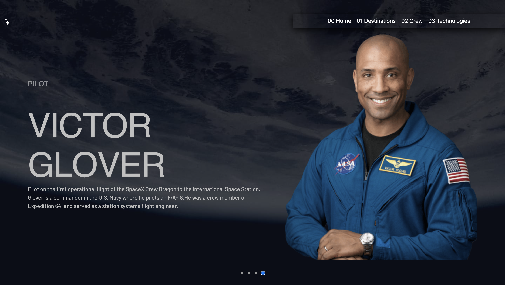

# Space tourism website solution

This is a solution to the [Space tourism website challenge on Frontend Mentor](https://www.frontendmentor.io/challenges/space-tourism-multipage-website-gRWj1URZ3). 

### Just want to challenge myself :)

## Table of contents

- [Overview](#overview)
  - [The challenge](#the-challenge)
  - [Screenshot](#screenshot)
  - [Links](#links)
- [My process](#my-process)
  - [Built with](#built-with)
  - [What I learned](#what-i-learned)
- [Author](#author)


## Overview

### The challenge

Users should be able to:

- View the optimal layout for each of the website's pages depending on their device's screen size
- See hover states for all interactive elements on the page
- View each page and be able to toggle between the tabs to see new information

### Screenshot




### Links

- Solution URL: (https://github.com/Ablacodeur/inside_space)
- Live Site URL: (https://inside-space.vercel.app/)

## My process

### Built with

- Semantic HTML5 markup
- CSS custom properties
- swiper-js 
- [React](https://reactjs.org/) - JS library


### What I learned

Along the way, I learnt how to utilize swiper js, react-router,create my own custom api and call it from within my component, and map with react js. I also had fun practicing using react function components.

To see how you can add code snippets, see below:

```html
<h1>Some jsx code I'm proud of</h1>
```
```js
  async function fetchAllData() {
    try {
      const fetchData = await DataAPI.fetchTech();
      setData(fetchData);
    } catch (error) {
      console.error('Error fetching data:', error);
    }
  }

  useEffect(() => {
    fetchAllData();
  }, [])

```

### run the server with
npm run dev-server

## Author

- Website - [Ablacodeur]
- X - [https://twitter.com/Ablacodeur]

